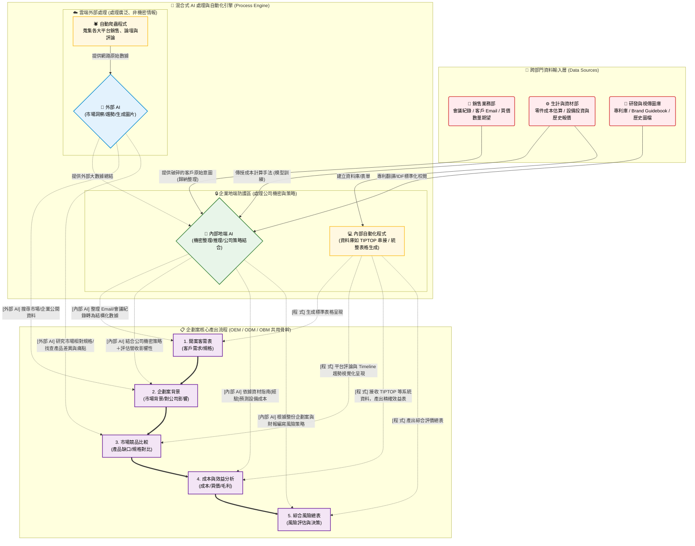

# 企業 AI 導入戰略架構圖：以「企劃案」為中心

這份架構圖拋開單一部門的視角，以「企劃案的生命週期」為中心，清楚呈現了**跨部門資料（銷售、資材、研發）如何流入**，以及**外部 AI**、**內部地端 AI**、**程式系統**在每一個階段的明確分工。

## 給老闆看的三大亮點解說

1. **🔒 內部地端 AI 的絕對重要性（大腦與守門員）**
   - 外部 AI 沒辦法看公司的財務報表與機密 Mail。
   - **銷售部**提供的客戶信件底價、**資材部**的成本計算經驗、**研發部**的專利寫法，全都在**地端 AI** 進行運算，確保**公司機密不外流**。
   - 內部 AI 的作用是**融合**：把外部 AI 找回來的「大環境數據」與「公司內部策略」進行交集中和，產生真正的「風險與效益評估」。

2. **🤖 外部 AI + 🕷️ 程式 的打擊火網（眼與耳）**
   - **程式系統 (Crawler)** 負責不知疲倦地爬取各大平台銷售與使用者評論。
   - **外部 AI** 負責將這些海量的評論、競爭者規格、論壇 KOL 的動態，濃縮成清晰的「產品缺口」與「市場趨勢」。這解決了過去「人工蒐集耗時且無法看清全貌」的問題。

3. **📋 打破部門穀倉，以「企劃案」為中心（執行力）**
   - 過去企劃案依賴行銷部四處追著人要資料（要銷售提供背景、要資材提供成本）。
   - 現在建立統一的流程。資料源頭一建立（例如一封客戶開案 Email 送入），內部 AI 就開始切分工作，程式自動生成表格。從**1.開案**一路流暢推動到**5.風險總表**，大幅降低 OEM (50%) 與 ODM (75%) 的編輯工時。
